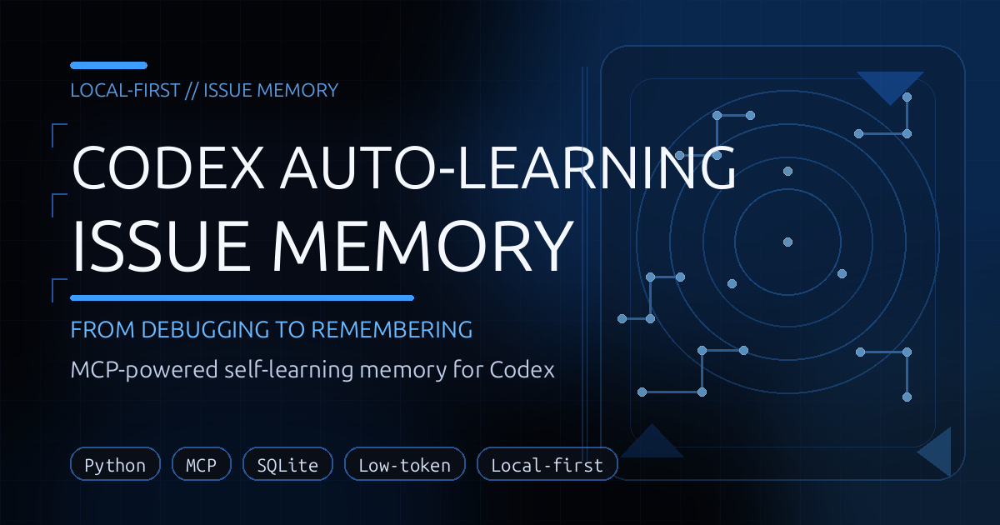

# codex-issue-memory



`codex-issue-memory` is a local-first MCP server for Codex. It stores verified fixes, retrieval feedback, preferences, and guardrails in SQLite so repeated failures can be diagnosed from prior evidence instead of re-debugged from scratch.

## What it provides

- **MCP runtime:** `python -m codex_issue_memory.server`
- **Public MCP tools:** 12 tools for matching, inspection, feedback, preferences, guardrails, metrics, and review
- **Maintenance CLI:** `issue-memory-maint` for schema setup, health checks, backups, telemetry, benchmarks, and lifecycle diagnostics
- **Local persistence:** SQLite DB plus state/log/backup directories under configurable local paths
- **Codex integration:** one authoritative live registration in `~/.codex/config.toml`
- **Optional wrapper metadata:** `.codex-plugin/plugin.json` and `.mcp.json` for local/custom plugin workflows only

## When to use it

Use this project when you want to:

- search prior fixes from a short error excerpt,
- keep reusable debugging knowledge local,
- record only verified reusable resolutions,
- learn from accepted/rejected retrievals,
- inspect server health, backups, and lifecycle state,
- keep Codex MCP setup reproducible across sessions.

## Quick start

```bash
git clone https://github.com/PhiniteLab/codex-issue-memory.git
cd codex-issue-memory
bash install.sh
bash scripts/verify_install.sh
```

The installer prepares a virtualenv, initializes the SQLite store, writes the live `issue_memory` MCP block to `~/.codex/config.toml`, and runs a local verification pass.

## Installation modes

### Install Mode A — Standard MCP install

Use this for the real runtime.

```bash
bash install.sh
bash scripts/verify_install.sh
```

Verify the live registration:

```bash
grep -n '^\[mcp_servers.issue_memory\]' ~/.codex/config.toml
issue-memory-maint smoke
issue-memory-maint doctor --mode shadow --max-instances 0
```

Expected posture:

- exactly one live `[mcp_servers.issue_memory]` block,
- writable Linux/WSL-local SQLite/state paths,
- successful smoke and doctor output.

### Manual package setup

```bash
python3 -m venv .venv
. .venv/bin/activate
python -m pip install --upgrade pip setuptools wheel
python -m pip install -e .[dev]
python -m codex_issue_memory.maintenance init-db
python -m codex_issue_memory.server
```

Then add one live `[mcp_servers.issue_memory]` block to `~/.codex/config.toml`.

### Install Mode B — Plugin-wrapper metadata

Use this only when you need local/custom plugin metadata or manual marketplace-style integration.

```bash
python3 -m json.tool .codex-plugin/plugin.json
python3 -m json.tool .mcp.json
```

Mode B does **not** create the Python runtime, initialize the database, or register the live MCP server. For runtime use, choose Mode A or manual registration.

## MCP tools

### Retrieval and inspection

- `issue_match` — find likely prior issue patterns for a failure
- `issue_get` — load full details for one pattern
- `issue_search` — keyword search stored patterns
- `issue_recent` — list recent patterns

### Write-back and learning

- `issue_record_resolution` — store a verified reusable fix
- `issue_feedback` — record accepted/rejected/fix feedback

### Preferences and guardrails

- `issue_set_preference` — save prompt-driven strategy preferences
- `issue_list_preferences` — list saved preferences
- `issue_guardrails` — retrieve proactive prevention guidance

### Operations and review

- `issue_metrics` — report operational metrics
- `issue_review_queue` — list pending/resolved review items
- `issue_review_resolve` — resolve review queue items

## Maintenance CLI

Common commands:

```bash
issue-memory-maint smoke
issue-memory-maint smoke-learning
issue-memory-maint doctor --mode shadow --max-instances 0
issue-memory-maint server-status
issue-memory-maint metrics --window-days 30
issue-memory-maint review-queue --status pending --limit 20
issue-memory-maint e2e-mcp-reuse-harness --json
```

Useful command groups:

- **Schema:** `init-db`, `migrate-v2`, `schema-version`
- **Backups:** `backup`, `list-backups`, `verify-backup`, `restore-backup`
- **Health/lifecycle:** `smoke`, `smoke-learning`, `server-status`, `runtime-diagnostics`, `recommended-config`, `doctor`, `e2e-mcp-reuse-harness`
- **Telemetry/retention:** `metrics`, `export-dashboard`, `prune-retention`
- **Review queue:** `review-queue`, `resolve-review`
- **Benchmarks/calibration:** `benchmark-user-domains`, `benchmark-failure-taxonomy`, `benchmark-dense-bandit`, `benchmark-real-world`, `benchmark-hard-negatives`, `benchmark-merge-stress`, `calibrate-thresholds`, `calibrate-weights`, `analyze-feature-importance`, `sweep-implicit`
- **Experiment registry:** `create-experiment`, `update-experiment`, `analyze-experiment`

For the complete CLI surface:

```bash
issue-memory-maint --help
```

## Python API example

```python
from codex_issue_memory.app import IssueMemoryApp

app = IssueMemoryApp()

result = app.issue_match(
    error_text="ModuleNotFoundError: No module named requests",
    command="python worker.py",
    file_path="api/worker.py",
    project_scope="my-repo",
)
print(result["decision"])
```

```python
app.issue_record_resolution(
    title="Missing dependency in worker runtime",
    raw_error="ModuleNotFoundError: No module named requests",
    canonical_fix="Install the dependency in the same runtime environment used by the target process.",
    prevention_rule="Pin and install runtime dependencies before process startup.",
    project_scope="my-repo",
)
```

## Architecture flow

```text
Failure excerpt
  ↓
Normalize into a query profile
  ↓
Retrieve candidates from SQLite-backed memory
  ↓
Rank and decide: match / ambiguous / abstain
  ↓
Return compact guidance through MCP
  ↓
Record feedback and verified reusable fixes
```

## Runtime authority and safety

- Keep the live MCP authority in `~/.codex/config.toml`.
- Keep exactly one `[mcp_servers.issue_memory]` block unless you intentionally manage alternatives.
- Prefer Linux/WSL-local writable paths for DB, state, logs, and backups.
- Treat `.mcp.json`, `.codex-plugin/`, `templates/`, and bundled `skills/` as distribution/reference material, not the live runtime authority.
- Write memories only after a fix is verified and reusable.
- Use project-specific scope when a memory should not be global.

## Validation

Recommended local checks:

```bash
bash scripts/verify_install.sh
python -m pytest
python -m codex_issue_memory.maintenance smoke
python -m codex_issue_memory.maintenance server-status
python -m codex_issue_memory.maintenance e2e-mcp-reuse-harness --json
```

Optional checks when available:

```bash
pyright
ruff check src tests scripts
```

## Troubleshooting

- **Codex does not show `issue_memory`:** restart Codex and verify exactly one live `[mcp_servers.issue_memory]` block.
- **Install problems:** retry with `SKIP_CRON_INSTALL=1 bash install.sh` and confirm Python/venv access.
- **Weak retrieval quality:** pass a short meaningful error excerpt plus command, file path, and project scope.
- **DB path or permission issues:** keep the writable DB under local Linux/WSL storage such as `~/.local/share/codex-issue-memory`.

## Documentation map

Start with [`docs/README.md`](docs/README.md). Key docs:

- [`docs/INSTALLATION.md`](docs/INSTALLATION.md)
- [`docs/CONFIGURATION.md`](docs/CONFIGURATION.md)
- [`docs/USAGE.md`](docs/USAGE.md)
- [`docs/OPERATIONS.md`](docs/OPERATIONS.md)
- [`docs/OWNER_KEY_CONTRACT.md`](docs/OWNER_KEY_CONTRACT.md)
- [`docs/ORCHESTRATION_STDIO_REUSE_CHECKLIST.md`](docs/ORCHESTRATION_STDIO_REUSE_CHECKLIST.md)
- [`docs/ARCHITECTURE.md`](docs/ARCHITECTURE.md)
- [`docs/DEVELOPMENT.md`](docs/DEVELOPMENT.md)
- [`docs/ROADMAP.md`](docs/ROADMAP.md)

## Repository layout

```text
src/codex_issue_memory/             MCP runtime, services, storage, matching, maintenance
src/codex_issue_memory/sql/         SQLite migrations packaged with the runtime
scripts/                            install, registration, backup, and verification helpers
docs/                               public and contributor documentation
templates/                          reference snippets and plugin-wrapper examples
skills/                             bundled reference skill content
tests/                              regression, lifecycle, diagnostics, and benchmark tests
reports_lifecycle_investigation/    historical lifecycle debugging notes and test evidence
.codex-plugin/                      local/custom plugin metadata
.mcp.json                           wrapper server templates
```

## Contributing

Contributions improving install clarity, retrieval quality, operational safety, and validation are welcome. See [`CONTRIBUTING.md`](CONTRIBUTING.md) and [`docs/DEVELOPMENT.md`](docs/DEVELOPMENT.md).

## License

MIT. See [`LICENSE`](LICENSE).
